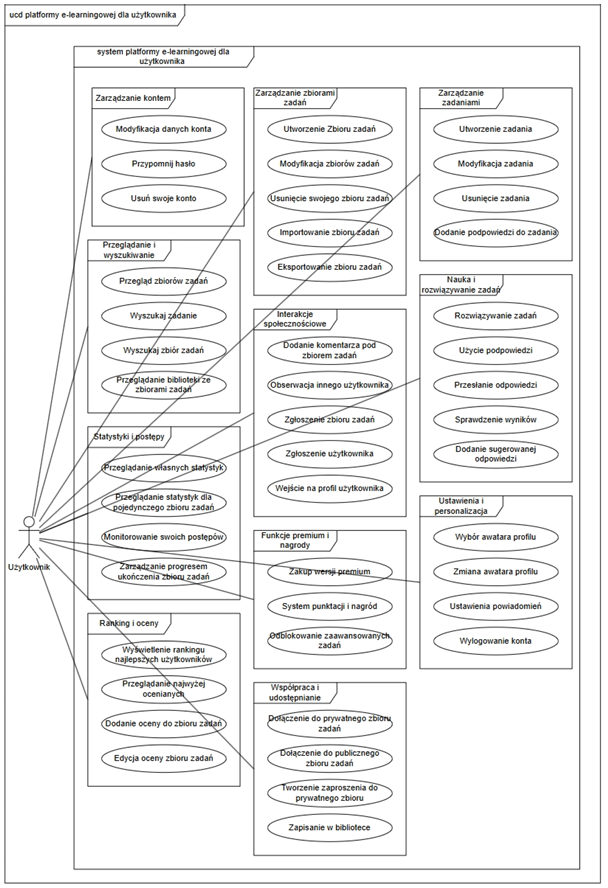

# Platforma e-learningowa z kreatorem zbiorów zadań  

Projekt inżynierski stworzony w ramach studiów na kierunku **Informatyka** (Collegium Da Vinci, 2025).  
Celem było opracowanie nowoczesnej platformy e-learningowej, umożliwiającej tworzenie, rozwiązywanie i ocenianie zbiorów zadań przez społeczność uczniów i studentów.  

## 🎯 Funkcjonalności  
- Rejestracja i logowanie użytkowników (JWT, sesje, role).  
- Tworzenie i edycja zbiorów zadań (różne typy zadań).  
- Rozwiązywanie zadań i śledzenie progresu.  
- Oceny i komentarze społeczności.  
- System zgłoszeń.  
- Panel administratora i moderatora.  
- Śledzenie aktywności użytkownika (czas spędzony w aplikacji).  

## 🛠️ Stack technologiczny  

**Frontend:**  
- React  
- Tailwind CSS  
- Vite  

**Backend:**  
- NestJS (TypeScript)  
- JWT (autoryzacja)  
- Prisma (ORM)  

**Baza danych:**  
- PostgreSQL  

**Testy:**  
- Cypress (end-to-end)  
- Postman (API)  

## 👥 Zespół i role  
- **Marcin Lar** – zarządzanie projektem, backend  
- **Wiktor Czyż** – frontend, testy  
- **Mieszko Grempka** – frontend, UI/UX  
- **Ivan Afanasiev** – baza danych, backend  

## 🚀 Uruchomienie projektu  

### Wymagania  
- Node.js  
- PostgreSQL  

### Kroki  
1. Sklonuj repozytorium  
   ```bash
   git clone https://github.com/MieteX1/LearnUp.git
   ```  
2. Zainstaluj zależności (frontend i backend osobno):  
   ```bash
   npm install
   ```  
3. Uruchom bazę danych i wykonaj migracje Prisma:  
   ```bash
   npx prisma migrate dev
   ```  
4. Uruchom aplikację:  
   - Frontend: `npm run dev`  
   - Backend: `npm run start:dev`  

## 📊 Architektura  
  

## 📌 Możliwy rozwój  
- Rozbudowa kreatora zbiorów o kolejne typy zadań.  
- Wprowadzenie systemu odznak i rankingów.  
- Wdrożenie hostingu w chmurze.  
- Optymalizacja bezpieczeństwa (Argon2 zamiast bcrypt).  

---  

⚡ **Pełna dokumentacja projektu** znajduje się w folderze [`/docs`](./docs).  
